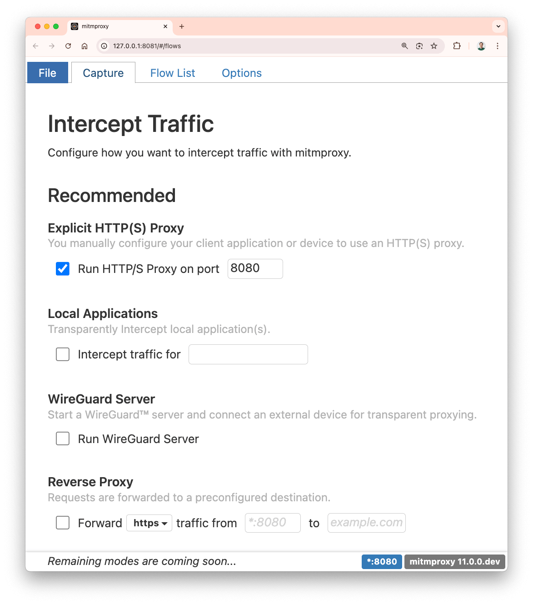

Mitmweb now features a dedicated tab to configure traffic capture, enabling users to dynamically select their preferred proxy mode. 
Work is still underway as part of this year's Google Summer of Code, but a first preview is available in [mitmproxy&nbsp;10.4](https://github.com/mitmproxy/mitmproxy/releases/tag/v10.4.0).

<!--more-->

##### *Editorial Note: Hi!*

*Hi! My name is [Matteo Luppi], and I’m one of this year’s GSoC students for mitmproxy. Under the mentorship of [Maximilian Hils], my primary focus has been on enhancing mitmweb. In this blog post, I’ll introduce you to our new Capture tab page in mitmweb.*

[Matteo Luppi]: 
[Maximilian Hils]:  

## New Capture Tab

My GSoC work aims to improve the onboarding experience for new mitmproxy users and simplify the UX for those who enjoy using mitmweb. Enhancing the visibility and accessibility of proxy modes, in particular the new [local redirect mode](), was a key goal.

In previous versions of mitmweb, changing the proxy mode was only possible deep down in the options editor or by restarting mitmweb with custom arguments. In either case, the functionality wasn't easy to discover. As you might imagine, this process could be quite confusing and obscure for first-time users. To address this, we designed a new Capture tab page where all the proxy modes are listed, allowing users to change modes easily and intuitively on the fly.

## How it works

When users run mitmweb from the terminal and no traffic has been captured yet, they will be greeted by the new capture page instead of an empty flow list. Once traffic appears, mitmweb will automatically switch to the flow list.

## What’s Next?

This feature represents my work for the first part of GSoC, and there’s still much room for improvement. Upcoming enhancements include adding the remaining proxy modes, introducing the ability to run multiple reverse proxies, [and much more](https://github.com/mitmproxy/mitmproxy/issues/7063). If you have and feedback or suggestions, please do reach out and leave a comment on GitHub!

## Acknowledgments

This work supported by the [NGI0 Entrust fund](https://nlnet.nl/entrust/) established by [NLnet], and 
[Google Summer of Code] under the umbrella of the [Honeynet&nbsp;Project].
I would like to thank my mentor Max, who has been incredibly supportive and helpful throughout this project!

[Honeynet&nbsp;Project]: https://www.honeynet.org/
[Google Summer of Code]: https://summerofcode.withgoogle.com/
[NLnet]: https://nlnet.nl/
