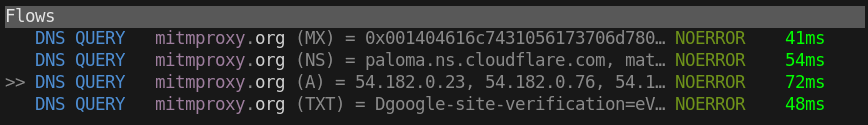

We are excited to announce the release of mitmproxy 11, which introduces full support for HTTP/3 in both transparent
and reverse proxy modes. We're also bringing in a ton of DNS improvements that we'll cover in this blog post.

<!--more-->

##### *Editorial Note:*

*Hi! I'm [Gaurav Jain], one of the students selected for this year's Google Summer of Code program to work on mitmproxy.
During this summer, I've worked on improving various low-level networking parts of mitmproxy some of which include
HTTP/3 and DNS. You can find my project report [here].*

[Gaurav Jain]:  
[here]: https://gist.github.com/errorxyz/af6f26549e9122f3ff3b93fd9d257df1

## HTTP/3

HTTP/3 now "just works" for reverse proxies. Your mitmproxy instance will listen for
both TCP and UDP packets and handle all HTTP versions thrown at it:

```shell
$ mitmproxy --mode reverse:https://http3.is
```

Our transparent proxy modes now all support HTTP/3 as well:

```shell
$ mitmproxy --mode wireguard
$ mitmproxy --mode local
$ mitmproxy --mode transparent
```

We have successfully tested HTTP/3 support with Firefox, Chrome, various cURL builds, and other clients to iron out 
compatibility issues.
The only limitation we are aware of is that Chrome [does not trust user-added Certificate Authorities for QUIC].
This means your will either need to provide a publicly trusted certificate (e.g. from Let's Encrypt), start Chrome with 
a [command line switch], or accept that it falls 
back to HTTP/2. Alternatively, Firefox doesn't do such shenanigans.

Bringing HTTP/3 support to mitmproxy is a major effort that was started in 2022 by [Manuel Meitinger] and [Maximilian Hils]. 
QUIC and HTTP/3 make up an increasing share of network traffic in the wild, and we're super excited to have this ready
and enabled by default now!


[Manuel Meitinger]: 
[Maximilian Hils]:  
[initial codebase]: 
[does not trust user-added Certificate Authorities for QUIC]: https://issues.chromium.org/issues/40138351#comment15
[command line switch]: https://www.chromium.org/quic/playing-with-quic/#generate-certificates
[easily disabled]: https://docs.mitmproxy.org/stable/concepts-options/#http3


<!--
In the background, mitmproxy automatically updates [Alt-Svc] headers and strips [Encrypted Client Hello]
records,
Note that we can run the reverse proxy on any port irrespective of the port advertised by the [alt-svc] header.
We also support proxying HTTP3 flows via local-redirect mode.

[Alt-Svc]: https://developer.mozilla.org/en-US/docs/Web/HTTP/Headers/Alt-Svc
[Encrypted Client Hello]: https://blog.cloudflare.com/announcing-encrypted-client-hello/

```shell
$ mitmproxy --mode local --set experimental_transparent_http3=true
```

Any cURL, Chromium or Firefox based HTTP/3 client ([setup]) can be used to access these features. There are still some
bugs that are yet to be fixed which you can find in our [bug-tracker].

[setup]: https://github.com/mitmproxy/mitmproxy/issues/7025#issuecomment-2351138170
[bug-tracker]: https://github.com/mitmproxy/mitmproxy/issues

--> 

## Improved DNS Support

With the advent of DNS [HTTPS records] and new privacy enhancements such as [Encrypted Client Hello (ECH)], mitmproxy's DNS
functionality is becoming increasingly important. We're happy to share multiple advancements on this front: 

[HTTPS records]: https://blog.cloudflare.com/speeding-up-https-and-http-3-negotiation-with-dns/
[Encrypted Client Hello (ECH)]: https://en.wikipedia.org/wiki/Server_Name_Indication#Encrypted_Client_Hello

#### Support for Query Types Beyond A/AAAA

mitmproxy's old DNS implementation used `getaddrinfo` to resolve queries. This is convenient because everything is taken
care of by libc, but the `getaddrinfo` API only supports A/AAAA queries for IPv4 and IPv6 addresses. It doesn't allow us
to answer queries for e.g. [HTTPS records], which are used to signal HTTP/3 support. 

To overcome this limitation, we've reimplemented our DNS support on top of [Hickory DNS], a Rust-based DNS library.
Using Hickory, we now obtain the operating system's default nameservers on Windows, Linux, and macOS and forward 
non-A/AAAA queries there. This behavior can also be customized with the new [`dns_name_servers` option]:

[Hickory DNS]: https://github.com/hickory-dns/hickory-dns
[`dns_name_servers` option]: https://docs.mitmproxy.org/stable/concepts-options/#dns_name_servers
[`dns_use_hosts_file` option]: https://docs.mitmproxy.org/stable/concepts-options/#dns_use_hosts_file

```shell
$ mitmdump --mode dns --set dns_name_servers=8.8.8.8
```



#### Skipping /etc/hosts

By switching to Hickory, we also get the additional benefit that we can decide to ignore the system's hosts
file (`/etc/hosts` on Linux) with the new [`dns_use_hosts_file` option]. We plan to move mitmproxy's internal
DNS resolution to Hickory as well, at which point this feature will become incredibly useful in allowing transparent
redirection on the same machine for particular domains. At the moment, such a setup would cause mitmproxy to recursively
connect to itself, as it also uses the hosts file when establishing an upstream connection.

```shell
$ echo "192.0.2.1 mitmproxy.org" >> /etc/hosts

$ mitmdump --mode dns
$ dig @127.0.0.1 +short mitmproxy.org
192.0.2.1

$ mitmdump --mode dns --set dns_use_hosts_file=false
$ dig @127.0.0.1 +short mitmproxy.org
3.161.82.13
```

#### DNS-over-TCP

DNS uses UDP by default, but may switch to TCP for records that do not fit into a single packet. mitmproxy has
previously only supported the UDP variant, but now that we support arbitrary query types, message size is a practical
concern. Long story short, DNS-over-TCP now also works!

#### Stripping Encrypted Client Hello (ECH) Keys

Unless a custom certificate is configured, mitmproxy uses the Server Name Indication (SNI) transmitted by the
client during the TLS handshake to construct a valid certificate. Conversely, if no SNI is present, we may not be able
to generate a certificate that is trusted by the client.

[Encrypted Client Hello (ECH)] is an exciting new technology to increase privacy on the web. In short, the client uses
the new DNS HTTPS records to obtain an ECH key before establishing a connection, and then already encrypts the initial 
ClientHello handshake message with that key. If both DNS queries and handshake are encrypted, passive intermediaries 
cannot learn the target domain, only the target IP (which is not conclusive for shared hosting and Content Delivery 
Networks). This is a great advancement for privacy, but also breaks mitmproxy's way of generating certificates. 
To fix this, mitmproxy now strips ECH keys from HTTPS records. This way the client has no keys to encrypt the initial 
handshake message with, and mitmproxy still learns the target domain and can construct a matching certificate.

Of course, ECH adds complexity for us and sometimes makes mitmproxy harder to use for our users. Nonetheless, we are
excited to see these advancements being made!

## Acknowledgements

This work supported by [Google Summer of Code] under the umbrella of the [Honeynet&nbsp;Project], and the
[NGI0 Entrust fund](https://nlnet.nl/entrust/) established by [NLnet]. Thank you to my mentor [Maximilian Hils] for the
invaluable guidance and support.

[Honeynet&nbsp;Project]: https://www.honeynet.org/
[Google Summer of Code]: https://summerofcode.withgoogle.com/
[NLnet]: https://nlnet.nl/
